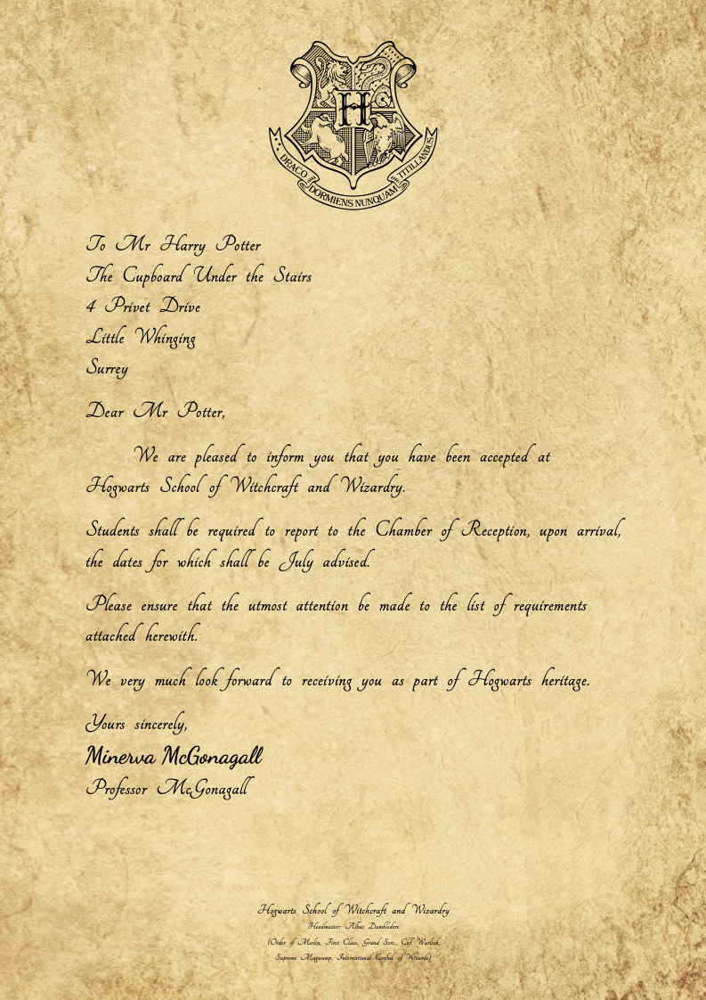
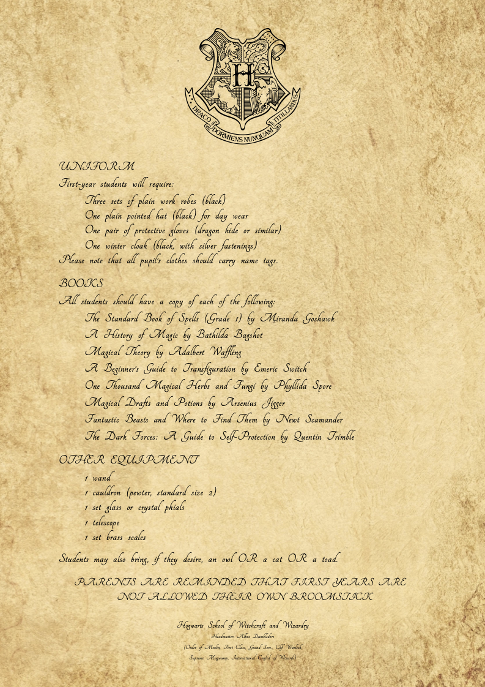

# Hogwarts Acceptance Letter

This is a Typst project that generates a Hogwarts acceptance letter.

## Showcase

 

## Usage

1. Clone the repository.

2. To run the project on local, install Typst and the fonts. 

   To run the project on Typst online editor, simply upload all the files to it.

3. Preview and compile ```letter.typ```.

4. Fine adjustments might be needed in ```lib.typ``` if other fonts or assets are used.

## Licence

The fonts are licensed under the SIL Open Font License. The images are licensed under their corresponding licenses. All other content is licensed under the MIT License.
